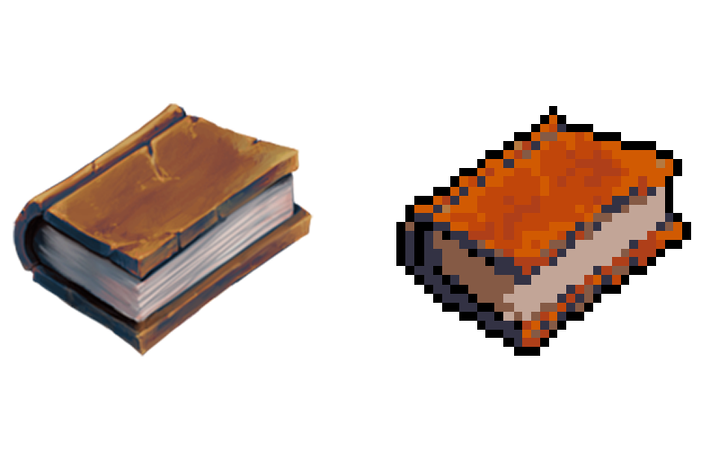

# Pixelizer_Depixelizer

## Group Members (Name/USP ID):
- Andre Seiti Caniza (9790923)
- Bruno Waldvogel (9847690)
- Marcel Otoboni de Lima (9791069)

## Main Idea of the Project

Transform a given image to a pixel-art representation, and vice-versa. 

## Pixelizer

The name Pixelizer refers to the process of transforming the image in a pixel art representation with a limited pallete of colors. To start with, we are going to work on images representing objects or characters, like books, video-game characters and so on. Our main goal for this first part is to accomplish something like the following:

## Depixelizer

If there is any remaining time left by the end of the semester, our second goal is to reverse the process mentioned above, i.e, transforming an original pixel-art image into a smooth countour-lined image using algorithms such as xBR or HQX (popular fast image upscaling algorithms), like the following examples:

